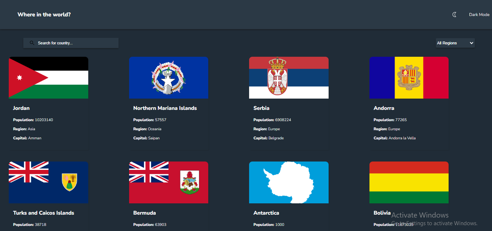
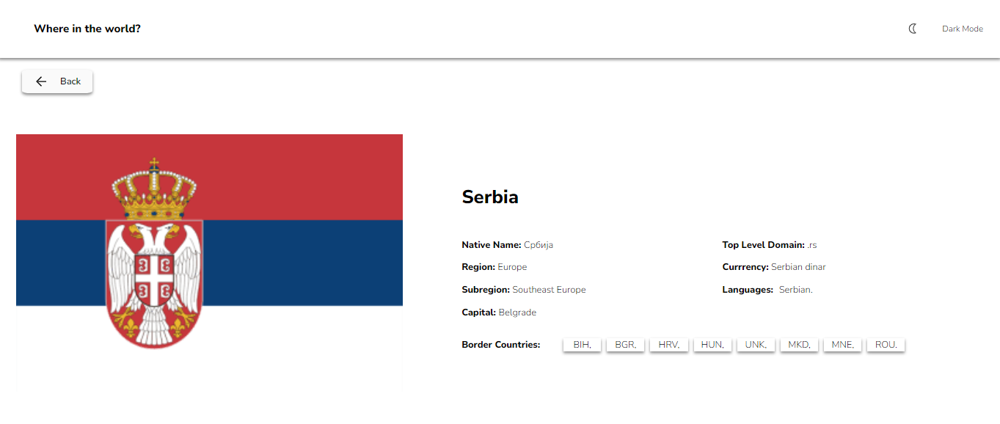
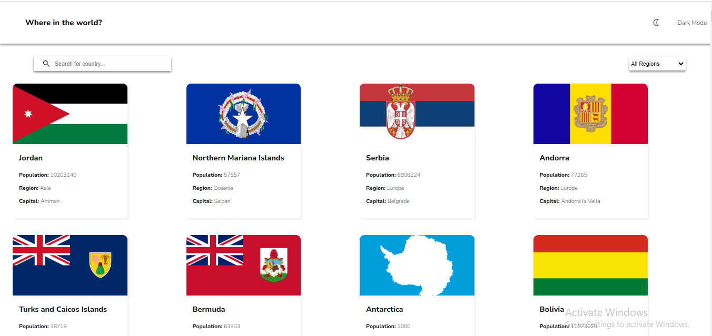

# Frontend Mentor - REST Countries API with color theme switcher solution

This is a solution to the [REST Countries API with color theme switcher challenge on Frontend Mentor](https://www.frontendmentor.io/challenges/rest-countries-api-with-color-theme-switcher-5cacc469fec04111f7b848ca). Frontend Mentor challenges help you improve your coding skills by building realistic projects.

## Table of contents

- [Overview](#overview)
  - [The challenge](#the-challenge)
  - [Screenshot](#screenshot)
  - [Links](#links)
- [My process](#my-process)
  - [Built with](#built-with)
  - [What I learned](#what-i-learned)
  - [Continued development](#continued-development)
  - [Useful resources](#useful-resources)
- [Author](#author)
- [Acknowledgments](#acknowledgments)

## Overview

Creating this project has been amazing. Being commited to finishing it within 2 days isn't something I thought I could do. It wasn't easy but all thanks to God it ended in praise

### The challenge

Users should be able to:

- See all countries from the API on the homepage
- Search for a country using an `input` field
- Filter countries by region
- Click on a country to see more detailed information on a separate page
- Click through to the border countries on the detail page
- Toggle the color scheme between light and dark mode _(optional)_

### Screenshot






### Links

- Solution URL: [Add solution URL here](https://github.com/OdecoGlobal/Rest-Country-Challenge)
- Live Site URL: [Add live site URL here](https://rest-country-challenge-odecoglobal.vercel.app)

## My process

### Built with

- JSX
- CSS custom properties
- Flexbox
- CSS Grid
- Desktop first workflow
- [React](https://reactjs.org/) - JS library

### What I learned

This is my first off tutorial react project. I learnt a lot in this project. I learnt how to fetch data in Rest api and how to use the Grid layout. This is also the first project in which I used grid to build. It was amazing and worth it.

Use

```css
.detail-container {
  display: grid;
  grid-template-columns: 1fr 1fr 1fr 1fr;
  row-gap: 40px;
  max-width: 100vw;
  margin: 30px;
  font-size: 13px;
  text-align: left;
}
.detail-container .details-link {
  text-decoration: none;
  color: inherit;
}
.detail-container p {
  margin-left: 15px;
}
```

```jsx
// import React from "react";
import { Link } from "react-router-dom";
import "./DetailsList.css";
import { useTheme } from "../hooks/useTheme";

export default function DetailsList({ details }) {
  const { mode } = useTheme();
  if (details.length === 0) {
    return <div className="error">No country to load....</div>;
  }
  return (
    <div className={`detail-container ${mode}`}>
      {details.map((detail) => (
        <Link
          to={`/about/${detail.name.common.toLowerCase()}`}
          key={detail.name.common}
          className="details-link"
        >
          <div className={`countries ${mode}`}>
            <div className="flag">
              
            </div>
            <p className="name">{detail.name.common}</p>
            <div className="data">
              <p>
                <span>Population: </span>
                {detail.population}
              </p>
              <p>
                <span>Region: </span>
                {detail.region}
              </p>
              <p>
                <span>Capital: </span>
                {detail.capital}
              </p>
            </div>
          </div>
        </Link>
      ))}
    </div>
  );
}
```

### Continued development

I want to focus and improve my react skills and the use of flex and grid layout. I also want to improve on my css skills too

### Useful resources

- [Example resource 1](https://chat.openai.com) - This helped me when i got stucked in fetching data, I used to find a way to escape error while fetching data of countries that do not have border
- [Example resource 2](https://www.w3schools.com) - This is an amazing website. I strongly recommend for anyone that wants to improve his or her CSs skills.

## Author

- Frontend Mentor - [@OdecoGlobal](https://www.frontendmentor.io/profile/OdecoGlobal)
- Twitter - [@M_Derah](https://www.twitter.com/M_Derah)

## Acknowledgments

Special shout out to my Tutors where I have learnt the skilss of HTML, CSS, JavaScript and React.
Shout out to my Teachers, Shaun Pelling, Jonas Schmedtman, FreeCodeCamp.org. I can't forget YouTube channels where I gain Knowledge from, Travesy, Netninja, JavaScript Mastery, WedDev simplified to mention but a few. I am forever grateful
